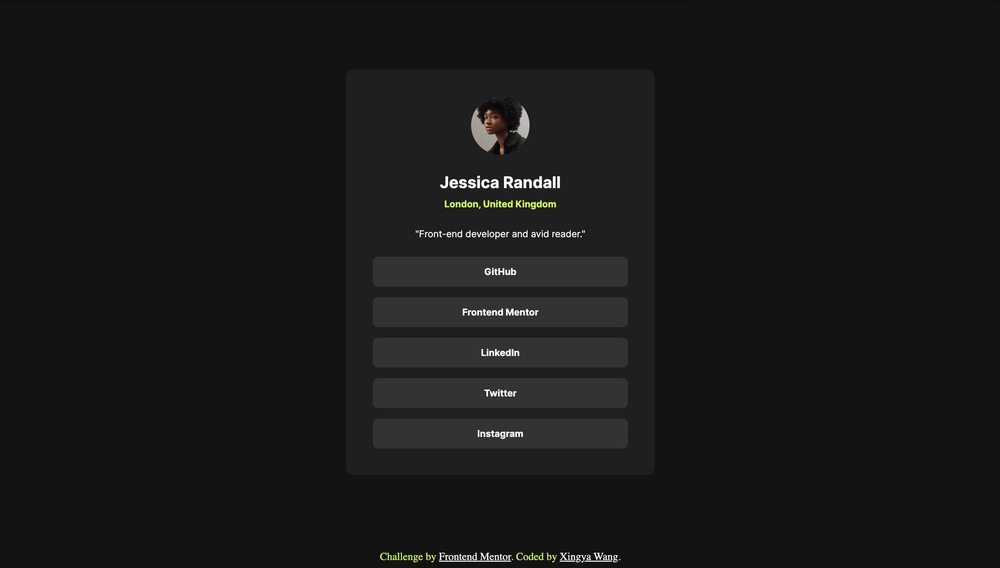

# Frontend Mentor - Social links profile solution

This is a solution to the [Social links profile challenge on Frontend Mentor](https://www.frontendmentor.io/challenges/social-links-profile-UG32l9m6dQ). Frontend Mentor challenges help you improve your coding skills by building realistic projects. 

## Table of contents

- [Overview](#overview)
  - [The challenge](#the-challenge)
  - [Screenshot](#screenshot)
  - [Links](#links)
- [My process](#my-process)
  - [Built with](#built-with)
  - [What I learned](#what-i-learned)
  - [Continued development](#continued-development)
- [Author](#author)
- [Acknowledgments](#acknowledgments)

## Overview

### The challenge

Users should be able to:

- See hover and focus states for all interactive elements on the page

### Screenshot



### Links

- Solution URL: [GitHub](https://github.com/frontend-mentor-projects-repo/social-links-profile-main)
- Live Site URL: [Live Site](https://frontend-mentor-projects-repo.github.io/social-links-profile-main/)

## My process

### Built with

- HTML5
- CSS
- Flexbox

### What I learned

I learned about **"stack" design** in CSS using [this article](https://every-layout.dev/layouts/stack/). For example, to set margin-top for only "inner items", use
```css
.stack > * + * {
  margin-block-start: 1.5rem;
}
```
which literally means for every (direct) child of `class="stack"` that has a preceding child, add a top margin of 1.5rem.

I also learned to use **rem** more when working with font sizes. This allows the user to be able to adjust their screen font sizes according to their needs.

I also worked more with **margin** in CSS. Understanding default margins applied through **"inspect"/"devtools"** and then resolve the margins respectively.

Finally, I can view and style the design more readily in terms of groups of elements. 

### Continued development

I would like to remember more common syntax for:
* including custom fonts (still needed to consult my past code)
* work more often with "inspect"/"devtools" to get more intuition on the CSS elements

## Author

- GitHub - [@wxyzz22](https://github.com/wxyzz22)
- Frontend Mentor - [@wxyzz22](https://www.frontendmentor.io/home)
- LinkedIn - [Xingya Wang](https://www.linkedin.com/in/xingya-wang/)

## Acknowledgments

Special thanks to my mentor [@HarryLyons](https://github.com/GregLyons) for guidance and advice. And thanks for ChatGPT for saving my time on Google.